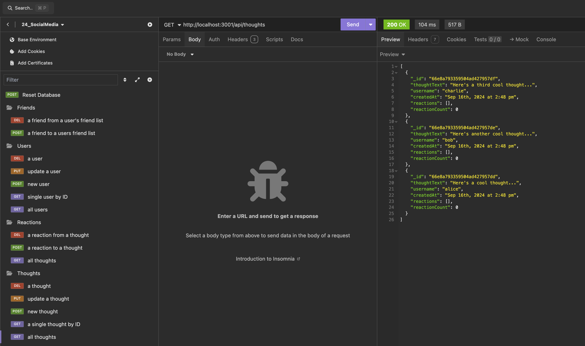

# 24_SocialMedia

## Description

This project is a RESTful API for a social network web application where users can share their thoughts, react to friends' thoughts, and create a friend list. It uses Express.js for routing, MongoDB as the database, and Mongoose as the ODM (Object Document Mapper).

## Table of Contents

- [Installation](#installation)
- [Usage](#usage)
- [API Routes](#api-routes)
- [Demo](#demo)
- [Technologies Used](#technologies-used)
- [Contributing](#contributing)
- [License](#license)

## Installation

1. Clone the repository to your local machine.
2. Navigate to the project directory.
3. Run `npm install` to install the necessary dependencies.
4. Ensure MongoDB is installed and running on your machine.

## Usage

1. Start the server by running `node server.js` in the terminal.
2. Use a tool like Insomnia or Postman to test the API routes.

## API Routes

### Users
- GET /api/users - Get all users
- GET /api/users/:userId - Get a single user by ID
- POST /api/users - Create a new user
- PUT /api/users/:userId - Update a user
- DELETE /api/users/:userId - Delete a user

### Thoughts
- GET /api/thoughts - Get all thoughts
- GET /api/thoughts/:thoughtId - Get a single thought by ID
- POST /api/thoughts - Create a new thought
- PUT /api/thoughts/:thoughtId - Update a thought
- DELETE /api/thoughts/:thoughtId - Delete a thought

### Reactions
- POST /api/thoughts/:thoughtId/reactions - Add a reaction to a thought
- DELETE /api/thoughts/:thoughtId/reactions/:reactionId - Remove a reaction from a thought

### Friends
- POST /api/users/:userId/friends/:friendId - Add a friend to a user's friend list
- DELETE /api/users/:userId/friends/:friendId - Remove a friend from a user's friend list

## Demo

### Screenshot

### Video Walkthrough
[Click here to view the Screencastify demo - GET](https://app.screencastify.com/v2/manage/videos/JXgxh99y8zr6qIDC57dV)

[Click here to view the Screencastify demo - PUT & POST](https://app.screencastify.com/v2/manage/videos/KalsHj64muad4wLOZRGs)

[Click here to view the Screencastify demo - DELETE](https://app.screencastify.com/v2/manage/videos/t98tHi49PZvvKGlB8C1D)

## Technologies Used

- Node.js
- Express.js
- MongoDB
- Mongoose

## Contributing

Contributions to this project are welcome. Please fork the repository and submit a pull request with your changes.

## License

